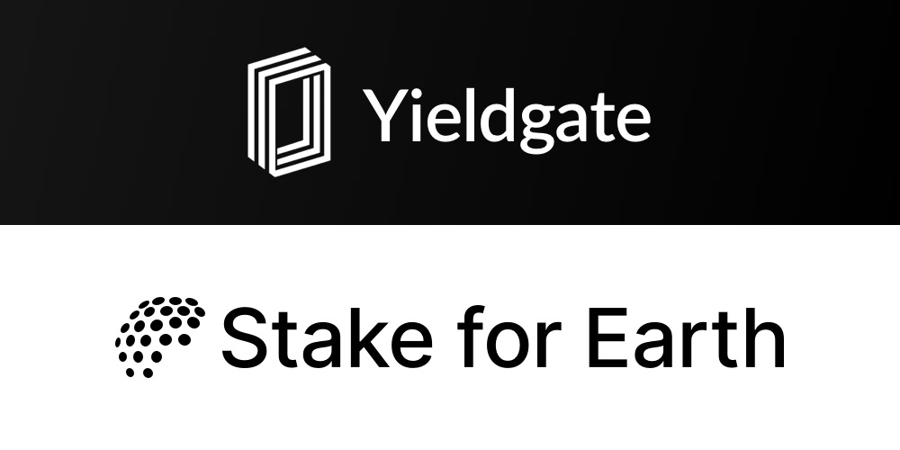

# Yieldgate 🤝 Stake for Earth

Welcome to Yieldgate 🤝 Stake for Earth!

Yieldgate is an innovative app designed to empower individuals like you to contribute towards the betterment of our planet. With Yieldgate, you can make a positive impact by participating in sustainable investment opportunities and supporting environmental projects.

Our app combines the power of blockchain technology and sustainable finance, allowing you to stake your assets and earn rewards while actively supporting initiatives focused on environmental conservation, clean energy, reforestation, and more. By participating in Yieldgate, you become an integral part of the global movement towards a greener and more sustainable future.

Key Features:

1. Sustainable Investments: Discover a wide range of investment opportunities aligned with your environmental values. From green energy projects to sustainable agriculture, Yieldgate offers carefully curated options to maximize your positive impact.

2. Staking and Rewards: Stake your assets in the app and earn attractive rewards. By engaging in staking, you directly contribute to the funding of impactful environmental initiatives and earn benefits for your participation.

3. Project Transparency: We believe in transparency and accountability. Yieldgate provides detailed information about the environmental projects you support, including updates on progress, impact measurement, and financial statements.

4. Community Engagement: Join a vibrant community of like-minded individuals who share your passion for sustainability. Connect, learn, and collaborate with other users, experts, and project leaders to amplify the impact of your efforts.

5. Education and Resources: Stay informed and expand your knowledge about environmental sustainability through educational resources, articles, and expert insights available in the app. We aim to empower our users with the information they need to make informed decisions.

Yieldgate is committed to creating a world where both financial prosperity and environmental conservation go hand in hand. Together, let's build a brighter future for our planet. Stake for Earth with Yieldgate!

Note: Yieldgate is not affiliated with any specific financial institution or investment company. Please make sure to do your own research and consult with professionals before making any investment decisions.

This repository serves as a codebase for two overlapping projects:

- **Yieldgate** ([yieldgate.xyz](https://yieldgate.xyz)) is a protocol that allows anyone to start earning and building products with programmable yield. It originated as a finalist hackathon project at ETHIndia in Banglore.
- **Stake for Earth** ([stakefor.earth](https://stakefor.earth)) is a pool which generates compounding yield to enable climate action at 0 cost.

This project is backed by Aave, Toucan, The Graph, Polygon, Coinbase, and WalletConnect. ❤️



---

## The Stack

- Package-Manager: `pnpm`
- Monorepo Tooling: `turborepo`
- Smart Contract Development: `hardhat`
  - Deploy & Address-Export: `hardhat-deploy`
  - Typescript-Types: `typechain`
- Frontend: `next`
  - Contract Interactions: `wagmi`, `rainbowkit`
  - Styling: `tailwindcss`, `chakra-ui`
  - Styled Components: `twin.macro`, `emotion`
- Misc:
  - Linting & Formatting: `eslint`, `prettier`
  - Actions on Git Hooks: `husky`, `lint-staged`

See [ETHathon](https://github.com/ethathon/ethathon) for a equally set-up dApp-development boilerplate.

## Getting Started

```bash
# Install (or update) pnpm
npm i -g pnpm

# Install project dependencies
pnpm install

# Copy & fill environments
cp packages/frontend-sfe/.env.local.example packages/frontend-sfe/.env.local && nano packages/frontend-sfe/.env.local
cp packages/frontend-yg/.env.local.example packages/frontend-yg/.env.local && nano packages/frontend-yg/.env.local
cp packages/contracts/.env.example packages/contracts/.env && nano packages/contracts/.env
```

## Development

When working in VSCode, it's recommended doing so by opening the workspace file located at `.vscode/yieldgate.code-workspace` and installing recommended plugins listed in `.vscode/extensions.json`.

```bash
# Generate types, artifacts & start both frontends
pnpm run dev

# Generate types, artifacts & start frontend (Yieldgate-only)
pnpm run dev-yg

# … or only start frontend if types are generated previously (Yieldgate-only)
pnpm run dev:frontend-yg

# Start local hardhat network & deploy contracts
pnpm run deploy:contracts
```
